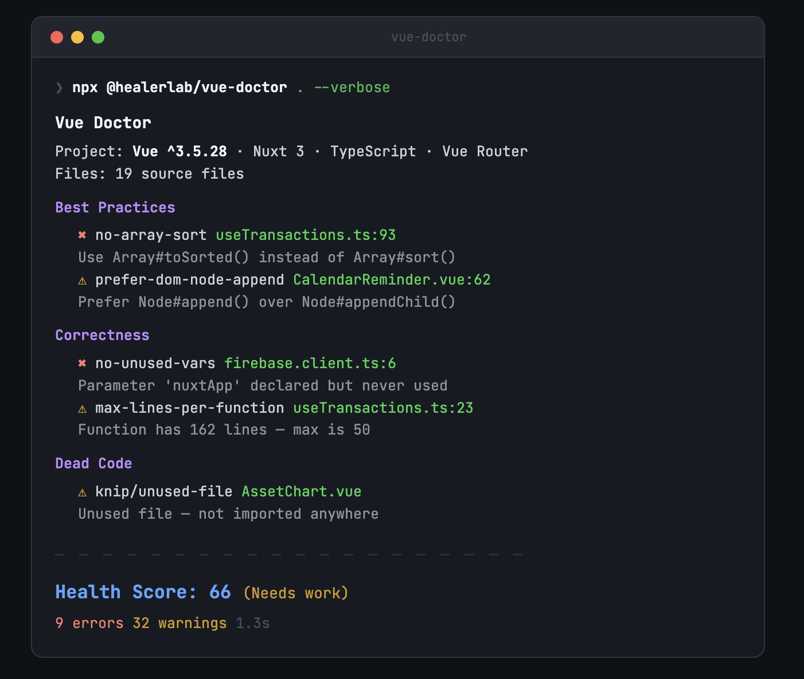

# Vue Doctor

[](https://www.npmjs.com/package/@healerlab/vue-doctor)
[](https://github.com/healerlab/vue-doctor/blob/main/LICENSE)
[](https://www.skills.sh/healerlab/vue-doctor/vue-doctor)

> 🩺 Diagnose and fix issues in your Vue.js app.

One command scans your codebase for security, performance, correctness, and architecture issues, then outputs a **0–100 health score** with actionable diagnostics.

## Demo

<p align="center">
  
</p>
## How it works

Vue Doctor detects your framework (Nuxt, Vite, Vue CLI), Vue version, and project setup, then runs **four analysis engines in parallel**:

| Engine | What it checks |
|---|---|
| **oxlint** | Script-level: performance, security, correctness |
| **eslint-plugin-vue** | Template-level: directives, reactivity, best practices |
| **Custom rules** | Vue-specific anti-patterns: reactivity loss, Nuxt SSR, Pinia misuse |
| **knip** | Dead code: unused files, exports, types, dependencies |

## Quick Start

```bash
npx @healerlab/vue-doctor@latest .
```

Verbose mode (show file + line per issue):

```bash
npx @healerlab/vue-doctor@latest . --verbose
```

## Install as Coding Agent Skill

Teach your AI coding agent (Cursor, Claude Code, Antigravity, Windsurf, etc.) Vue best practices.

**Via [skills.sh](https://skills.sh) (the agent-skill registry):**

```bash
npx skills add healerlab/vue-doctor
```

**Or with the built-in installer** (auto-detects your agents and writes the skill to the right directory):

```bash
npx @healerlab/vue-doctor install-skill
```

Alternatively, pipe the install script:

```bash
curl -fsSL https://raw.githubusercontent.com/healerlab/vue-doctor/main/scripts/install-skill.sh | bash
```

## Usage

```bash
# Full scan with summary
npx @healerlab/vue-doctor .

# Verbose — show file + line per issue
npx @healerlab/vue-doctor . --verbose

# Diff mode — scan only changed files vs main
npx @healerlab/vue-doctor . --diff

# Diff vs specific branch
npx @healerlab/vue-doctor . --diff develop

# Fix mode — human-readable structured output for AI agents
npx @healerlab/vue-doctor . --fix

# JSON mode — machine-readable output for AI agents, coding agents & CI
npx @healerlab/vue-doctor . --json

# Score only (for CI gates)
npx @healerlab/vue-doctor . --score

# CI gate — exit 1 if the health score drops below a threshold
npx @healerlab/vue-doctor . --min-score 80

# Skip dead code analysis
npx @healerlab/vue-doctor . --no-dead-code
```

## Options

```
Usage: vue-doctor [options] [command] [directory]

Arguments:
  directory            project directory to scan (default: ".")

Options:
  -v, --version        output the version number
  --no-lint            skip linting
  --no-dead-code       skip dead code detection
  --verbose            show file details per rule
  --score              output only the score
  --diff [base]        scan only files changed vs base branch (default: main)
  --fix                output diagnostics for AI agents to auto-fix
  --json               output the full diagnosis as JSON (agents & CI)
  --min-score <number> exit 1 if the health score is below this threshold
  -h, --help           display help for command

Commands:
  install-skill        install vue-doctor skill for your AI coding agents
```

### JSON output (`--json`)

Built for AI agents, coding agents, and CI. Emits a stable, color-free document
on stdout — read a diagnostic, open `file:line:column`, apply `fix`, re-run.

```jsonc
{
  "schema": "vue-doctor/diagnosis@1",
  "score": { "value": 82, "label": "Great" },
  "project": { "framework": "nuxt3", "vueVersion": "^3.4.0", "typescript": true },
  "summary": { "total": 5, "errors": 1, "warnings": 4, "byCategory": { "Reactivity": 2 } },
  "diagnostics": [
    {
      "file": "src/components/User.vue",
      "line": 12, "column": 1,
      "severity": "error",
      "category": "Reactivity",
      "rule": "vue-doctor/reactivity-destructure-props",
      "message": "Destructuring props loses reactivity in Vue 3",
      "fix": "Use toRefs(props) or access props.xxx directly"
    }
  ],
  "diff": null,
  "elapsedMs": 1240
}
```

### Exit codes

| Code | Meaning |
|---|---|
| `0` | Completed (and score met `--min-score`, if set) |
| `1` | Score below `--min-score`, or the scan failed |

## Custom Rules

14 rules that catch Vue-specific anti-patterns:

| Rule | What it catches |
|---|---|
| `reactivity-destructure-props` | Destructuring props loses reactivity |
| `reactivity-reactive-reassign` | Reassigning reactive() breaks the proxy |
| `reactivity-ref-no-value` | Using ref without .value in script |
| `correctness-mutating-props` | Mutating a prop directly (read-only) |
| `perf-giant-component` | Components over 300 lines |
| `perf-v-for-method-call` | Method calls inside v-for |
| `perf-v-if-with-v-for` | v-if and v-for on the same element |
| `a11y-img-no-alt` | `` missing an alt attribute |
| `security-v-html` | v-html (XSS risk) |
| `nuxt-fetch-in-mounted` | useFetch inside onMounted (SSR issue) |
| `nuxt-no-navigate-to-in-setup` | navigateTo() without return |
| `pinia-no-store-to-refs` | Destructuring store without storeToRefs |
| `pinia-direct-state-mutation` | Direct store state mutation |
| `arch-mixed-api-styles` | Mixing Options + Composition API |

## GitHub Actions

```yaml
# .github/workflows/vue-doctor.yml
name: Vue Doctor
on:
  pull_request:
    branches: [main]

jobs:
  health-check:
    runs-on: ubuntu-latest
    steps:
      - uses: actions/checkout@v4
        with:
          fetch-depth: 0
      - uses: actions/setup-node@v4
        with:
          node-version: "20"
      - run: npx @healerlab/vue-doctor@latest . --diff main --verbose
```

See [more examples](docs/github-actions-examples.md).

## Configuration

Create a `.vue-doctorrc` in your project root:

```json
{
  "ignore": {
    "rules": ["vue/no-v-html", "knip/exports"],
    "files": ["src/generated/**"]
  }
}
```

## Node.js API

```ts
import { diagnose } from "@healerlab/vue-doctor/api";

const result = await diagnose("./path/to/your/vue-project");

console.log(result.score);       // { score: 82, label: "Great" }
console.log(result.diagnostics); // Array<Diagnostic>
console.log(result.project);     // { framework: "nuxt3", vueVersion: "^3.4.0", ... }
```

## Contributing

Contributions are welcome! Here's how to get started:

```bash
# Clone the repo
git clone https://github.com/healerlab/vue-doctor.git
cd vue-doctor

# Install dependencies
pnpm install

# Build
pnpm run build

# Run locally
node packages/vue-doctor/dist/cli.mjs . --verbose

# Run docs site
pnpm run docs:dev
```

### Pull Request Guidelines

- Fork the repo and create your branch from `main`
- If you've added a new rule, add documentation in `docs/rules/`
- Make sure the build passes (`pnpm run build`)
- Keep PRs focused — one feature or fix per PR

### Project Structure

```
vue-doctor/
├── packages/vue-doctor/src/   # Core source code
│   ├── cli.ts                 # CLI entry point
│   ├── index.ts               # Public API
│   └── utils/                 # Analysis engines & helpers
├── docs/                      # VitePress documentation
├── scripts/                   # Install scripts
└── skills/                    # AI agent skill definitions
```

## License

[MIT](LICENSE) © [HealerLab](https://github.com/healerlab)
